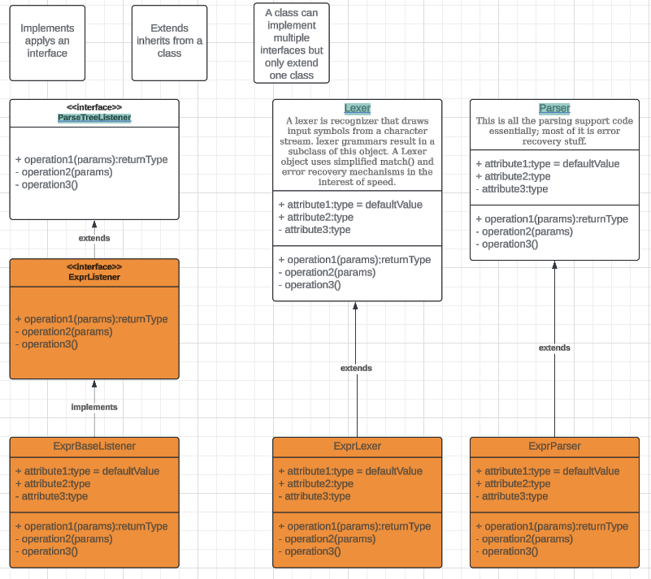

# Notes on how to use


## tour



### Build 

#### build using book

```
$ antlr4 Expr.g4
```

#### build using ninja

```
$ ninja
or
$ ninja -t clean
```


### Test

* `grun` is an alias for java vm cli to run the jar file.
* `t.expr` is the sample script we are parsing

```
$ grun Expr prog -gui t.expr
or
$ ninja
```


